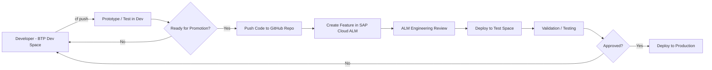

# Arthrex SAP COE – GitHub Organization

Welcome to the **Arthrex SAP COE GitHub Organization**.

This space supports application lifecycle management (ALM), automation, and cloud-native development across SAP and non-SAP solutions.

---

## CI/CD Workflow (Visual)

---

## Purpose of This Organization

- Central source of truth for application code
- Controlled CI/CD for SAP BTP applications
- Integration with SAP Cloud ALM (cALM)
- Governance via ALM Engineering (Release Management)

---

## Key Repository

### BTP_CloudFoundry_Dev
Main repository for deployable Cloud Foundry applications.

Use this repo when:
- Your app is ready to move beyond Dev
- You want promotion to Test/Prod
- You need governance + traceability

---

## Developer Workflow

### 1. Develop in BTP Dev Space
- Create space
- Deploy using CF CLI (`cf push`)
- Iterate freely

### 2. Push to GitHub
Repository:
https://github.com/Arthrex-SAP-COE/BTP_CloudFoundry_Dev

### 3. Create Feature in SAP Cloud ALM
Include:
- Purpose
- Scope
- Testing expectations

### 4. ALM Engineering Promotion
- Deploy to Test
- Validate
- Promote to Production

---

## Responsibilities

### Developers
- Build and test in Dev space
- Push stable code to GitHub
- Create cALM Features

### ALM Engineering
- Review changes
- Deploy to Test/Prod
- Ensure governance and auditability

---

## Access Requirements

### SAP BTP
- Cloud Foundry access
- Dev space creation rights

### GitHub
- Access to Arthrex-SAP-COE org
- Repo contributor access

### SAP Cloud ALM
- Feature creation access

---

## Best Practices

- Keep apps modular
- Use environment variables
- Avoid hardcoding credentials
- Document your app
- Test thoroughly in Dev

---

## Notes

If it needs to move forward → it belongs in GitHub.
