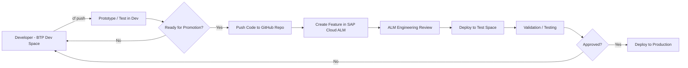
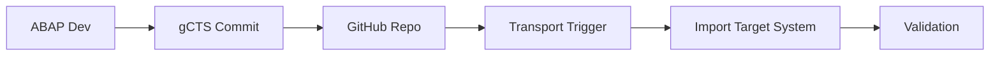

# Arthrex SAP COE – GitHub Organization

Welcome to the **Arthrex SAP COE GitHub Organization**.

This space supports application lifecycle management (ALM), automation, and cloud-native development across SAP and non-SAP solutions, aligned with **ALM Engineering (Release Management)** governance.

---

## CI/CD Workflow (Visual)

---

## Repository Overview

### BTP_CloudFoundry_Dev
Primary repository for Cloud Foundry applications.

### ABAPGit_Backups
Used for ABAPGit version control and backups.

### GRM-Python_Projects
Internal Python tools and automation apps (non-SAP).

---

## gCTS Flow

---

## Workflow Summary

1. Develop in Dev Space  
2. Push to GitHub  
3. Create Feature in cALM  
4. ALM Engineering promotes  

---

## Notes

If it needs to move forward → it belongs in GitHub.
